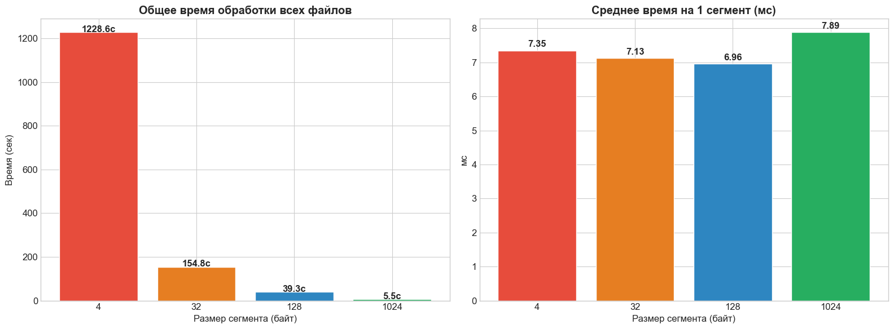
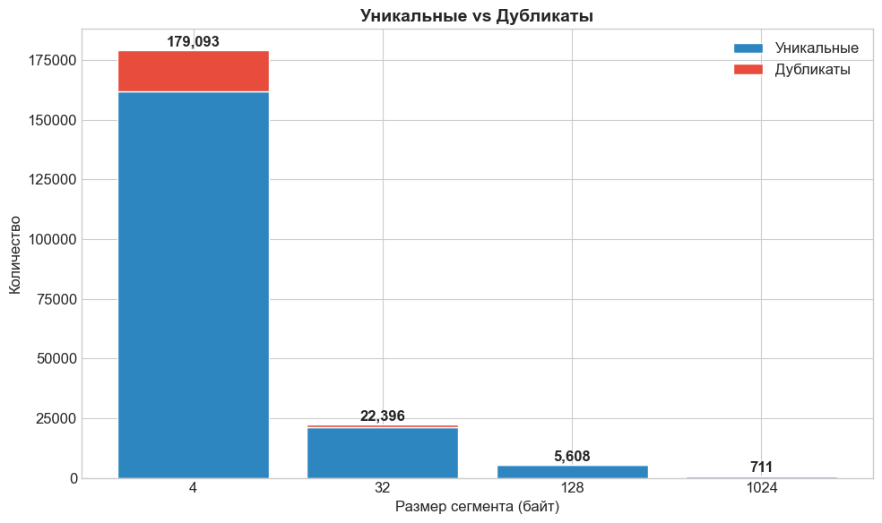
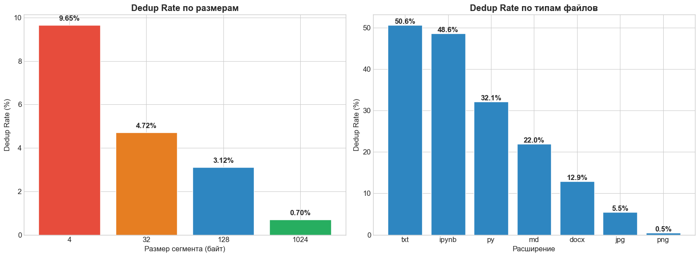
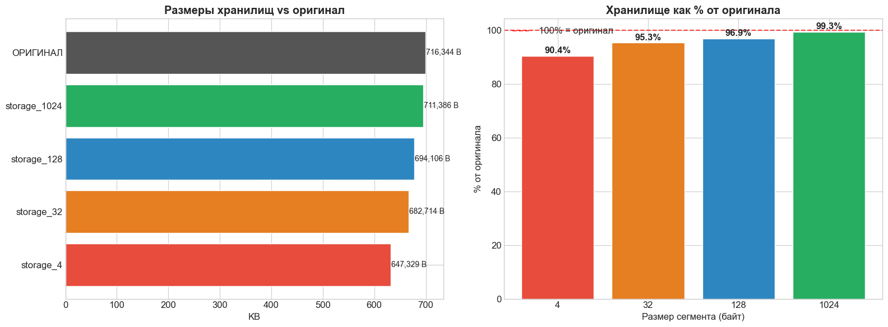

# Deduplication System

**Локальная система дедупликации файлов на уровне сегментов.**
Разделяет файлы на сегменты фиксированного размера, хеширует выбранным алгоритмом, сохраняет только уникальные сегменты в локальные бинарные файлы `data_storage/storage_{chunk_size}.bin` и хранит контракты восстановления в PostgreSQL.

---

## Стек

* Python 3.14
* PostgreSQL
* `psycopg2`, `python-dotenv`, `pandas`, `matplotlib`
* Локальное хранилище: `data_storage/`
* Исходные данные: `origin_data/`

---

## Что делает

* Нарезает файлы на сегменты (`CHUNK_SIZES` в `config.py`).
* Хеширует сегменты (`md5`, `sha256`, `sha512`…), сохраняет уникальные сегменты в БД.
* Хранит структуру файла и позволяет полностью восстановить его.
* Поддерживает интерактивный режим (`main.py`) и бенчмарк (`benchmark.py`).

---

## Быстрое руководство

### 1. Клонирование и установка

```bash
git clone https://github.com/Artarcadman/Data-deduplication-service
cd Data-deduplication-service
python -m venv venv
# Windows
venv\Scripts\activate
# macOS / Linux
source venv/bin/activate

pip install -r requirements.txt
```

### 2. Настройка PostgreSQL

Создать базу:

```sql
CREATE DATABASE db_dedupl;
```

Создать `.env` в корне проекта:

```env
POSTGRES_HOST=localhost
POSTGRES_PORT=5432
POSTGRES_DB=db_dedupl
POSTGRES_USER=postgres
POSTGRES_PASSWORD=artem
```

### 3. Инициализация таблиц

```bash
python init_db.py
```

### 4. Подготовка данных

Поместить файлы в папку:

```
origin_data/
```

### 5. Запуск

Интерактивный режим (запись / восстановление):

```bash
python main.py
```

Бенчмарк всех файлов:

```bash
python benchmark.py
# результат: analytics/benchmark_results.csv
```

---

# Performance Analysis

---

## Время обработки

<p align="center">
  
</p>

<p align="center">
  <em>Общее время обработки и среднее время на сегмент для разных размеров сегментов</em>
</p>

---

## Уникальные vs Дубликаты

<p align="center">
  
</p>

<p align="center">
  <em>Количество уникальных и дублирующихся сегментов</em>
</p>

---

## Коэффициент дедупликации

<p align="center">
  
</p>

<p align="center">
  <em>Dedup Rate = duplicate_segments / total_segments × 100%</em>
</p>

---

## Размеры хранилища vs Оригинал

<p align="center">
  
</p>

<p align="center">
  <em>Сравнение суммарного объёма storage_{chunk_size}.bin с размером исходных данных</em>
</p>

---

## Ключевые выводы

* На текстовых данных максимальная эффективность достигнута при `chunk_size = 4 байта`.
* Меньший сегмент → выше дедупликация, но больше метаданных и записей в индексах.
* `md5` - быстрый и компактный, подходит для локальных сценариев.
* `sha256` - оптимальный баланс, рекомендуемый вариант.
* `sha512` - повышенная криптостойкость, но больший размер метаданных.
* Для малых текстовых файлов: `4 байта + md5/sha256`.
* Для крупных бинарных данных: `128–1024 байт + sha256`.

---

## Чек-лист

* Выполнено подключение к PostgreSQL
* `.env` создан
* `init_db.py` выполнен
* Файлы в `origin_data/`
* Запуск через `main.py` или `benchmark.py`
